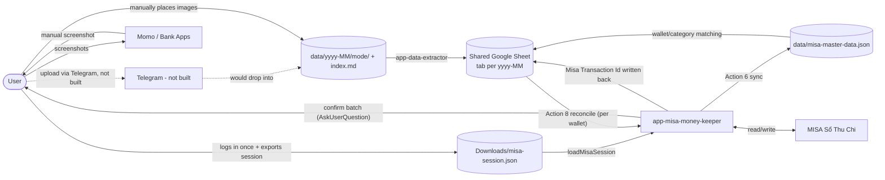

# MISA Assistant

Assisted MISA Sổ Thu Chi reconciliation: screenshots/statements → reviewed Google Sheet → human-approved MISA entries.

## Table of Contents

- [The Problem](#the-problem)
- [Architecture](#architecture)
- [Monthly Reconciliation Walkthrough (HDSD)](#monthly-reconciliation-walkthrough-hdsd)
- [Setup Guide](#setup-guide)
- [Before / After](#before--after)
- [Automated vs Human-Held](#automated-vs-human-held)
- [Roadmap](#roadmap)
- [Links](#links)

## The Problem

Transactions happen across several disconnected apps — Momo, Vietcombank, Techcombank — while the actual books live in MISA Sổ Thu Chi (MISA Money Keeper). Getting them from "happened in an app" to "recorded in MISA" today means manually re-typing every row: ~3-4 hours a month, and error-prone — missed entries, duplicates, wrong wallet or category. There's no existing step that compares "what the source apps show" against "what MISA already has" before committing changes, so mistakes compound silently.

This project is a human-approved assistant pipeline that removes the re-typing, while keeping a hard approval gate before anything is written to MISA — automation proposes, a person decides.

## Architecture

Two independently-triggered Claude Code skills, decoupled by the shared Google Sheet:

- **`app-data-extractor`** — turns screenshots (Momo, VCB) and Excel statements (Techcombank) into rows in a monthly sheet tab, resolving each row's MISA wallet/category as it goes.
- **`app-misa-money-keeper`** — reads/writes MISA directly (Business API + Playwright), and reconciles the sheet against MISA per wallet, with a single approval gate before any write.

Full detail, data flow, and documented deviations from the original design: [`docs/system-architecture.md`](docs/system-architecture.md).

## Monthly Reconciliation Walkthrough (HDSD)

1. **Place screenshots/statements** into `data/{yyyy-MM}/{source}/` (e.g. `data/2026-07/Momo/`), or an Excel statement into `data/TCB/` for Techcombank.
2. **Run the extractor skill** for each source/month (e.g. *"Extract Momo transactions from images: data/2026-07/Momo"*). Rows get appended to that month's Google Sheet tab; anything ambiguous is flagged `NEEDS REVIEW` rather than guessed.
3. **Review the sheet** — check `NEEDS REVIEW` rows, confirm resolved Wallet/Category look right.
4. **Export a MISA session** once via the `tools/misa-session-exporter` Chrome extension (one click, no manual login needed for later runs).
5. **Run reconciliation per wallet** (e.g. *"Reconcile VCB for 2026-07"*). This matches sheet rows against MISA's existing history and finds what's genuinely new.
6. **Approve the batch** — a single confirmation (`AskUserQuestion`) over the whole pending-insert list. Nothing is written to MISA before this step.
7. **Verify** — each inserted/matched row gets its `Misa Transaction Id` written back into the sheet; spot-check a row or two in the MISA UI itself.

## Setup Guide

**Prerequisites:**
- [Claude Code](https://docs.claude.com/en/docs/claude-code) installed.
- A Google account + a Google Sheet you own (the pipeline appends to it, one tab per month).
- A MISA Sổ Thu Chi (MISA Money Keeper) account with existing wallets/categories set up.
- Google Chrome (for the session-exporter extension).

**Steps:**

1. Clone this repo. Project skills under `.claude/skills/` are auto-discovered by Claude Code — no separate install step.
2. **Google Sheets access** — this project uses the `mcp-gsheets` MCP server:
   - Copy `.mcp.json.example` to `.mcp.json`.
   - Create a Google Cloud service account with Sheets API access, download its JSON key.
   - Set `GOOGLE_PROJECT_ID` to your GCP project id and `GOOGLE_APPLICATION_CREDENTIALS` to the path of that key file in `.mcp.json`.
   - Share your target Google Sheet with the service account's email address.
   - `.mcp.json` is gitignored — your real config never gets committed.
3. **MISA session export** — install the unpacked Chrome extension: see [`tools/misa-session-exporter/README.md`](tools/misa-session-exporter/README.md) for the exact steps. Log into MISA once, export the session, and Playwright automation reuses it without repeating the login flow.
4. **First run** — place a batch of screenshots/statements under `data/{yyyy-MM}/{source}/`, then follow the walkthrough above.

## Before / After

| | Before | After |
|---|---|---|
| Time per month | ~3-4 hours (manual re-typing + cross-checking) | ~30 minutes (target estimate — pending confirmation from a timed live run) |
| Time saved | — | ~85% |
| Missed/duplicate entries | Manual, error-prone | Matched against MISA history before insert; nothing written twice |

Throughput from real Apr–Jul 2026 usage: 58 sheet rows extracted across 4 months (not independently re-verified this pass — see evidence doc), 83 MISA transactions read back in a single month (June), 11 transactions inserted in one reconciliation batch (June), plus a follow-up 4-transaction batch (July) — see [`docs/before-after-evidence.md`](docs/before-after-evidence.md) for the full breakdown and sourcing.

## Automated vs Human-Held

| Step | Who |
|---|---|
| Reading screenshots/statements, extracting rows | Automated |
| Resolving Wallet/Category from prior patterns | Automated |
| Flagging ambiguous rows | Automated (never guesses) |
| Reviewing `NEEDS REVIEW` rows | **Human** |
| Matching sheet rows against MISA history | Automated |
| Confirming the pending-insert batch | **Human** (hard gate — nothing written to MISA without this) |
| Writing the approved batch to MISA | Automated, only after approval |

## Roadmap

- **Telegram intake** — not built. Screenshots/statements are placed into `data/` manually today.
- **Scheduler** — extraction and reconciliation are both user-initiated; no automatic trigger yet.
- **Sheet-based async approval** — approval today is a live confirmation during a reconciliation session, not a persisted sheet column a user can check off separately. See `docs/system-architecture.md` §11 for this and other documented deviations from the original design.

## Links

- [Product Requirements Document](docs/misa-integration-prd.md)
- [System Architecture](docs/system-architecture.md)
- [Before/After Evidence](docs/before-after-evidence.md)
- [`app-data-extractor` skill](.claude/skills/app-data-extractor/SKILL.md)
- [`app-misa-money-keeper` skill](.claude/skills/app-misa-money-keeper/SKILL.md)
- [MISA Session Exporter extension](tools/misa-session-exporter/README.md)
