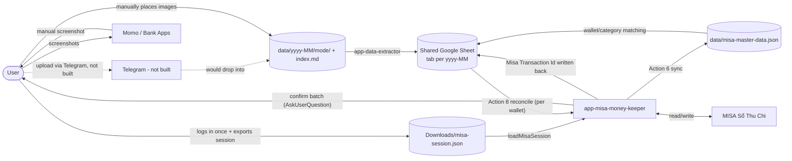
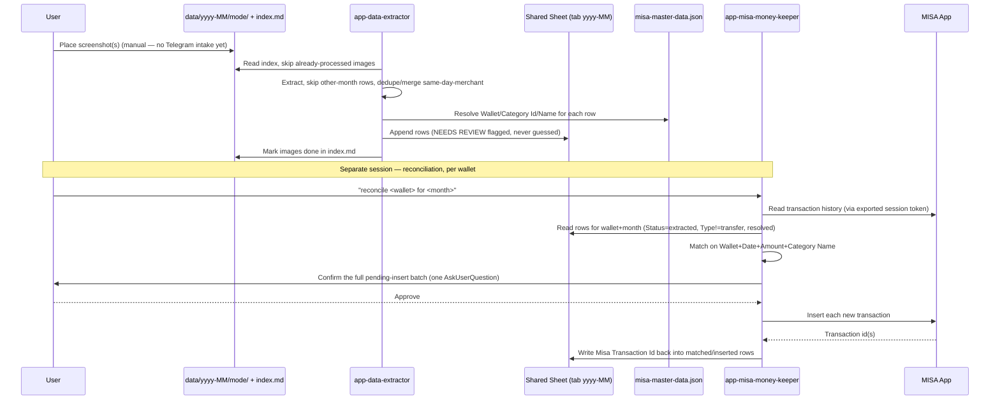

# System Architecture: MISA Multi-Source Integration

**Status:** Draft
**Source:** [misa-integration-prd.md](./misa-integration-prd.md)

## 1. Purpose

This document describes the high-level architecture for turning screenshots of Momo/bank-app transactions into reconciled, human-approved entries in MISA Sổ Thu Chi. It translates the PRD's requirements into components, data flow, and integration points. Implementation-level detail (file layout, exact code structure) belongs in the implementation plan, not here.

## 2. Guiding Principles

- **Human approval is a hard gate.** No component may write to MISA without a prior, recorded approval action.
- **Sheets are the source of truth for review**, not a side effect — every component reads from / writes to the sheet(s) rather than passing state privately between steps.
- **Idempotent by construction.** Re-running extraction or reconciliation on the same inputs must not create duplicate rows or duplicate MISA writes.
- **Thin automation, not a hosted service.** Given this is a single-user, batch-oriented workflow (see PRD Non-Goals: no real-time sync), the system is built as a set of Claude Code skills/scripts invoked per reconciliation session, not a standalone always-on server.

## 3. System Context

## 4. Components

Status legend: ✅ Implemented · 🚧 Planned / not built yet.

| Component | Responsibility | Status |
|---|---|---|
| **Intake** | Get screenshots into `data/{yyyy-MM}/{mode}/` | 🚧 No Telegram bot yet — images must be placed into that folder manually. PRD §7.1's Telegram upload step is not built. |
| **Image Index** | Track which images are already processed, per month (`data/{yyyy-MM}/index.md`) | ✅ Built into `app-data-extractor` |
| **Extractor** (`app-data-extractor` skill) | Vision-read each image (or parse each statement row for Techcombank), extract date/amount/description/type, skip out-of-period rows, dedupe/merge same-day-same-merchant rows, flag ambiguous rows `NEEDS REVIEW` | ✅ Momo, VCB, Techcombank implemented (per-mode reference files) — Techcombank's primary source is a structured Excel bank statement (`data/TCB/`, one file per wallet) rather than vision extraction; its screenshots (`data/{yyyy-MM}/TCB/`) are balance cross-check only |
| **Shared Google Sheet** | Single spreadsheet, one tab per month (`yyyy-MM`), all sources mixed in via a `Source` column | ✅ Implemented (`references/sheet-schema.md`) — this is **not** split per wallet/source, and there is **no separate master-MISA sheet**; reconciliation state lives as extra columns on the same rows (see §6) |
| **MISA Master Data Cache** (`data/misa-master-data.json`) | Snapshot of active wallets + expense/income categories, used to resolve `Wallet`/`Category Id`/`Category Name` on extracted rows | ✅ Implemented (`app-misa-money-keeper` Action 6) — full-overwrite snapshot, no auto-staleness check |
| **MISA Session Exporter** (`tools/misa-session-exporter`) | Chrome extension exporting the logged-in MISA session token to a fixed file, so automation doesn't need a live interactive browser tab | ✅ Implemented — removes the "must stay logged in during the run" constraint I originally assumed |
| **MISA Reader/Writer** (`app-misa-money-keeper` skill) | Read transaction history/wallets; write batch/transfer/balance-adjustment/single transactions | ✅ Implemented, 8 actions total (see `references/api-reference.md`) |
| **Reconciler + Approval + Write-back** (`app-misa-money-keeper` Action 8) | Match sheet rows against MISA history per wallet, confirm the new-insert batch with the user once, insert, write `Misa Transaction Id` back | ✅ Implemented — see §7.4 for how this differs from the PRD's original design |

## 5. Data Flow

## 6. Data Model (Sheets)

There is **one spreadsheet**, with **one tab per reconciliation month** (`yyyy-MM`). All sources share the tab (`Source` column distinguishes them) — there is no separate "master MISA sheet"; MISA-side state is just extra columns on the same rows.

Columns (see `app-data-extractor`'s `references/sheet-schema.md` for the authoritative definition):

`Date | Time | Description | Amount | Type (expense/income/transfer) | Source (Momo/VCB/Techcombank) | Image | Status (extracted/NEEDS REVIEW/SKIPPED) | Notes | Wallet | Category Id | Category Name | Misa Description | Misa Transaction Id`

- `Wallet`, `Category Id`, `Category Name`, `Misa Description` — written by the **extractor**, resolved against `misa-master-data.json`.
- `Misa Transaction Id` — written **only** by `app-misa-money-keeper` (Action 8); its presence is what prevents re-inserting a row on a later reconciliation pass. This is the dedupe mechanism, not a separate matched/unmatched status column.
- There is no persisted "approval status" column — approval happens as a live confirmation at reconciliation time (see §7.4), not as sheet state the user can set asynchronously.

**MISA Master Data Cache** (`data/misa-master-data.json`) — separate file, not a sheet: `syncedAt`, `wallets[]` (id/name/type/bank/currency), `categories.expense[]` (grouped tree), `categories.income[]` (flat). Full-overwrite snapshot on each sync.

## 7. Integration Details

### 7.1 Telegram — not built
- PRD §7.1 calls for Telegram as the upload channel; no bot exists yet. Today the user (or a future intake step) must place screenshots directly into `data/{yyyy-MM}/{mode}/` for the extractor to see them.

### 7.2 Image Extraction — ✅ implemented (`app-data-extractor`)
- Vision-based extraction (not fixed-template OCR, since Momo/bank app screenshots vary in layout); per-mode reference doc holds layout notes and a confirmed-only known-edge-case table (never speculative).
- Techcombank differs: primary source is a structured Excel bank statement per wallet (`data/TCB/`, filename encodes the account), parsed directly rather than vision-extracted — one file's date range commonly spans several months, so its rows are split across each affected month's sheet tab and index entry.
- Explicitly discards rows whose date falls outside the target month (scrolled screenshots can show adjacent months).
- Dedupes exact repeats from overlapping screenshots, then merges same-Date+Description+Type+Source rows into one (sums amount, keeps per-instance breakdown in `Notes`).
- Two run modes: **review** (default — pause for go-ahead before writing to the sheet) and **auto** (skip that pause; ambiguous rows still flag `NEEDS REVIEW` regardless of mode).

### 7.3 Google Sheets — ✅ implemented, via `mcp-gsheets` MCP
- One spreadsheet, tab-per-month, all sources mixed (see §6) — not the Sheets REST API directly, but an MCP server (`mcp-gsheets`) wrapping it.
- Append-only: existing rows are never overwritten, since later stages (Action 8) add state to them.
- Formatting must be applied *after* appending data, scoped to the exact written range — applying it beforehand causes bold/format bleed onto later-inserted rows (a documented gotcha in `sheet-schema.md`).

### 7.4 MISA Sổ Thu Chi — ✅ implemented (`app-misa-money-keeper`), differs from the PRD's original design
- **Reading** transactions/wallets/categories: direct Business API calls (`POST /transactions/pagingdashboard`, `POST /wallets/accounts`, `GET /incomeexpensecategorys/{0,1}`), authenticated via the `accessToken`/`sessionId` normally read from `localStorage`.
- **Session handling solves what I originally flagged as a semi-attended constraint:** the `tools/misa-session-exporter` Chrome extension exports that session to a fixed file (`Downloads/misa-session.json`); Playwright automation loads it (`loadMisaSession(page)`) without needing an interactive logged-in tab during the run. Only a full session expiry forces manual re-login + re-export.
- **Writing:** batch entry has no reverse-engineered API and goes through the real "Ghi chép hàng loạt" UI; transfer, balance-adjustment, and single expense/income writes *do* have direct API payloads (Actions 4/5/7) and are used as Action 8's insertion primitive.
- **Reconciliation (Action 8), matching, and approval — deviates from the PRD:**
  - Match key is **Wallet + Date + Amount + Category Name** (not just date+amount as the PRD specified) — tighter, fewer accidental collisions.
  - Runs **per wallet**, not whole-month-at-once.
  - Approval is a **single live confirmation** (`AskUserQuestion`) over the whole pending-insert batch during the reconciliation session — not a persisted sheet column the user can check off asynchronously as PRD §7.5 described. The hard-gate property (nothing written without explicit approval) still holds; only the *mechanism* differs.
  - Transfer-type rows are explicitly out of scope for this action pass (skipped, reported).
  - Action 8 never resolves Wallet/Category itself — it only proceeds on rows the extractor already resolved.

## 8. Execution Model

The pipeline is two independently-triggered skills, decoupled by the shared sheet — not one continuous pipeline:

1. **Extraction** (`app-data-extractor`) — runs whenever new screenshots exist under `data/{yyyy-MM}/{mode}/`; no MISA dependency, no session needed.
2. **Reconciliation** (`app-misa-money-keeper` Action 8) — triggered explicitly per wallet+month (e.g. "reconcile Cash Wallet for 2026-07"), needs a valid exported MISA session.

Both are invoked as Claude Code skills within an interactive session, not as a standalone always-on service — consistent with the PRD's non-goal of real-time sync. There is currently no scheduler/cron triggering either step; the user initiates both.

## 9. Reliability & Failure Handling

| Failure | Handling |
|---|---|
| Duplicate/overlapping screenshot | Extractor dedupes exact repeats and merges same-day-same-merchant rows within a batch; the image index prevents reprocessing an already-done image across runs |
| Ambiguous/illegible extraction | Row written with `Status = NEEDS REVIEW`, never guessed; a mode's known-edge-case table only grows from confirmed patterns |
| Wallet+Date+Amount+Category collision | Not yet resolved by Action 8 beyond the tighter match key; could still under/over-match if two genuinely different transactions share all four fields |
| MISA session expired | Reader/Reconciler/Writer steps fail closed; user re-logs in and re-exports via the session-exporter extension |
| Rejected proposal | Not written; PRD's "skip, no re-queue" behavior — Action 8 only asks for one batch confirmation, so a rejection means none of that batch is inserted this pass |
| Sheet formatting/append ordering mistakes | Documented gotchas in `sheet-schema.md` (format-after-append; batch-format overwrites the whole cell format object, not a merge) |

## 10. Security & Data Sensitivity

- All data involved (bank/wallet transactions, MISA session tokens) is real personal financial data — treat accordingly; the exported session file contains a live access token and must never be committed.
- Single-user system: no access control model needed beyond "only the account owner's Google/MISA credentials are used" (PRD §4).
- Approval trail: for Action 8, the confirmation itself is ephemeral (a chat exchange), but the resulting `Misa Transaction Id` written into the sheet is the durable record of what was actually synced.

## 11. Assumptions, Deviations & Open Decisions

- **Confirmed:** built and run as Claude Code skills, not a standalone hosted service (`app-misa-money-keeper` and `app-data-extractor` are both skills already built this way).
- **Confirmed:** session persistence is solved via `tools/misa-session-exporter`, not a constant live browser tab.
- **Deviation from PRD §7.5:** approval is a live batch confirmation during reconciliation, not a persisted sheet-based approve/reject column. If the user wants the sheet itself to carry approval state (so approval can happen without an agent session open), that's a gap to build, not yet present.
- **Deviation from PRD §7.4:** match key is Wallet+Date+Amount+Category Name, not just date+amount.
- **Gap vs PRD §7.1:** Telegram intake is not built; images must be placed manually into `data/{yyyy-MM}/{mode}/` today.
- **Open decision:** whether/how a scheduler triggers extraction or reconciliation automatically, vs. remaining fully user-initiated.

## 12. Out of Scope (carried from PRD)

- Real-time/instant sync, autonomous write-back without approval, automated screenshot capture, non-Momo/bank sources, multi-user access control, configurable hourly rate — see PRD §4 for full list.
